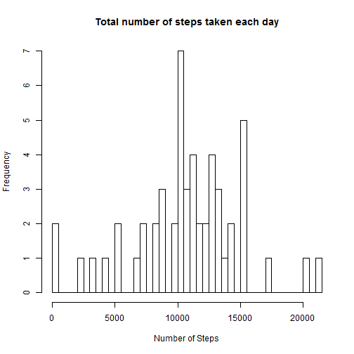

---
title: "Reproducible Research: Peer Assignment 1"
output: html_document
---
This report present analysis of personal movement based on data collected from a personal activity monitoring device. This device collects data at 5 minute intervals through out the day. The data consists of two months of data from an anonymous individual collected during the months of October and November, 2012 and include the number of steps taken in 5 minute intervals each day.    
<br />
<br />

####1) Loading and preprocessing the data
This code reads data from "activity.csv" file and typecast "date" column from type factor to date.

```r
download.file("http://d396qusza40orc.cloudfront.net/repdata%2Fdata%2Factivity.zip", "repdata-data-activity.zip", mode = "wb")
unzip("repdata-data-activity.zip")
data <- read.csv("activity.csv")
data[,"date"] <- as.Date(data[,"date"])
```
<br />

####2) What is mean total number of steps taken per day?
- Histogram to presents the total number of steps taken each day.  

```r
with(data[!is.na(x = data[]),], hist(tapply(steps, date, sum), xlab = "Number of Steps", main = "Total number of steps taken each day",  breaks = 50))
```

 
<br />

- Calculate Mean and Median total number of steps taken per day

```r
library(plyr)
```

```
## Warning: package 'plyr' was built under R version 3.1.1
```

```r
mean_median <- ddply(data[complete.cases(data),], ~date, summarise, mean = mean(steps), median = median(steps))
mean_median[,]
```

```
##          date       mean median
## 1  2012-10-02  0.4375000      0
## 2  2012-10-03 39.4166667      0
## 3  2012-10-04 42.0694444      0
## 4  2012-10-05 46.1597222      0
## 5  2012-10-06 53.5416667      0
## 6  2012-10-07 38.2465278      0
## 7  2012-10-09 44.4826389      0
## 8  2012-10-10 34.3750000      0
## 9  2012-10-11 35.7777778      0
## 10 2012-10-12 60.3541667      0
## 11 2012-10-13 43.1458333      0
## 12 2012-10-14 52.4236111      0
## 13 2012-10-15 35.2048611      0
## 14 2012-10-16 52.3750000      0
## 15 2012-10-17 46.7083333      0
## 16 2012-10-18 34.9166667      0
## 17 2012-10-19 41.0729167      0
## 18 2012-10-20 36.0937500      0
## 19 2012-10-21 30.6284722      0
## 20 2012-10-22 46.7361111      0
## 21 2012-10-23 30.9652778      0
## 22 2012-10-24 29.0104167      0
## 23 2012-10-25  8.6527778      0
## 24 2012-10-26 23.5347222      0
## 25 2012-10-27 35.1354167      0
## 26 2012-10-28 39.7847222      0
## 27 2012-10-29 17.4236111      0
## 28 2012-10-30 34.0937500      0
## 29 2012-10-31 53.5208333      0
## 30 2012-11-02 36.8055556      0
## 31 2012-11-03 36.7048611      0
## 32 2012-11-05 36.2465278      0
## 33 2012-11-06 28.9375000      0
## 34 2012-11-07 44.7326389      0
## 35 2012-11-08 11.1770833      0
## 36 2012-11-11 43.7777778      0
## 37 2012-11-12 37.3784722      0
## 38 2012-11-13 25.4722222      0
## 39 2012-11-15  0.1423611      0
## 40 2012-11-16 18.8923611      0
## 41 2012-11-17 49.7881944      0
## 42 2012-11-18 52.4652778      0
## 43 2012-11-19 30.6979167      0
## 44 2012-11-20 15.5277778      0
## 45 2012-11-21 44.3993056      0
## 46 2012-11-22 70.9270833      0
## 47 2012-11-23 73.5902778      0
## 48 2012-11-24 50.2708333      0
## 49 2012-11-25 41.0902778      0
## 50 2012-11-26 38.7569444      0
## 51 2012-11-27 47.3819444      0
## 52 2012-11-28 35.3576389      0
## 53 2012-11-29 24.4687500      0
```
<br />

####3) What is the average daily activity pattern?
- Time series plot of the 5 minute interval (x-axis) and the average number of steps taken, averaged across all days (y-axis)

```r
timeseries <- ddply(data[complete.cases(data),], ~interval, summarise, average_steps = mean(steps))
plot( x = timeseries$interval, y = timeseries$average_steps, type = "l", xlab = "Interval", ylab = "Average Steps", main = "Average Daily Activity")
```

 
<br />

- Displays the 5-minute interval which has maximum number of steps across all days.

```r
head(timeseries[order(timeseries$average_steps, decreasing = TRUE), ], 1)
```

```
##     interval average_steps
## 104      835      206.1698
```
<br />


####4) Imputing missing values
- Calculate and report the total number of missing values in the dataset (i.e. the total number of rows with NAs)

```r
nrow(data[!complete.cases(data),])
```

```
## [1] 2304
```
<br />

- Create new dataset and replace NAs with 0 by identifing missing data(NAs) in "steps" variable of "data1" dataset.

```r
data1 <- data
data1[is.na(data1$steps),"steps"] <-0
```
<br />

- Make a histogram of the total number of steps taken each day and Calculate and report the **mean** and **median** total number of steps taken per day.

```r
with(data1, hist(tapply(steps, date, sum), xlab = "Number of Steps", main = "Total number of steps taken each day",  breaks = 50))
```

 

```r
mean_median <- ddply(data1, ~date, summarise, mean = mean(steps), median = median(steps))
mean_median[,]
```

```
##          date       mean median
## 1  2012-10-01  0.0000000      0
## 2  2012-10-02  0.4375000      0
## 3  2012-10-03 39.4166667      0
## 4  2012-10-04 42.0694444      0
## 5  2012-10-05 46.1597222      0
## 6  2012-10-06 53.5416667      0
## 7  2012-10-07 38.2465278      0
## 8  2012-10-08  0.0000000      0
## 9  2012-10-09 44.4826389      0
## 10 2012-10-10 34.3750000      0
## 11 2012-10-11 35.7777778      0
## 12 2012-10-12 60.3541667      0
## 13 2012-10-13 43.1458333      0
## 14 2012-10-14 52.4236111      0
## 15 2012-10-15 35.2048611      0
## 16 2012-10-16 52.3750000      0
## 17 2012-10-17 46.7083333      0
## 18 2012-10-18 34.9166667      0
## 19 2012-10-19 41.0729167      0
## 20 2012-10-20 36.0937500      0
## 21 2012-10-21 30.6284722      0
## 22 2012-10-22 46.7361111      0
## 23 2012-10-23 30.9652778      0
## 24 2012-10-24 29.0104167      0
## 25 2012-10-25  8.6527778      0
## 26 2012-10-26 23.5347222      0
## 27 2012-10-27 35.1354167      0
## 28 2012-10-28 39.7847222      0
## 29 2012-10-29 17.4236111      0
## 30 2012-10-30 34.0937500      0
## 31 2012-10-31 53.5208333      0
## 32 2012-11-01  0.0000000      0
## 33 2012-11-02 36.8055556      0
## 34 2012-11-03 36.7048611      0
## 35 2012-11-04  0.0000000      0
## 36 2012-11-05 36.2465278      0
## 37 2012-11-06 28.9375000      0
## 38 2012-11-07 44.7326389      0
## 39 2012-11-08 11.1770833      0
## 40 2012-11-09  0.0000000      0
## 41 2012-11-10  0.0000000      0
## 42 2012-11-11 43.7777778      0
## 43 2012-11-12 37.3784722      0
## 44 2012-11-13 25.4722222      0
## 45 2012-11-14  0.0000000      0
## 46 2012-11-15  0.1423611      0
## 47 2012-11-16 18.8923611      0
## 48 2012-11-17 49.7881944      0
## 49 2012-11-18 52.4652778      0
## 50 2012-11-19 30.6979167      0
## 51 2012-11-20 15.5277778      0
## 52 2012-11-21 44.3993056      0
## 53 2012-11-22 70.9270833      0
## 54 2012-11-23 73.5902778      0
## 55 2012-11-24 50.2708333      0
## 56 2012-11-25 41.0902778      0
## 57 2012-11-26 38.7569444      0
## 58 2012-11-27 47.3819444      0
## 59 2012-11-28 35.3576389      0
## 60 2012-11-29 24.4687500      0
## 61 2012-11-30  0.0000000      0
```
<br />

####5) Are there differences in activity patterns between weekdays and weekends?
- Make a panel plot containing a time series plot (i.e. type = "l") of the 5-minute interval (x-axis) and the average number of steps taken, averaged across all weekday days and weekend days (y-axis). 

```r
library(lattice)
data1[,"dayType"] <- as.factor(ifelse(test = !weekdays(data1$date) %in% c("Sunday" , "Saturday"), "weekday", "weekend"))
with(ddply(data1, .(dayType,interval), summarise, average_steps = mean(steps)), xyplot(average_steps~interval|dayType, type = "l", xlab = "Interval", ylab = "Average Steps", layout = c(1,2)))
```

 
<br />


